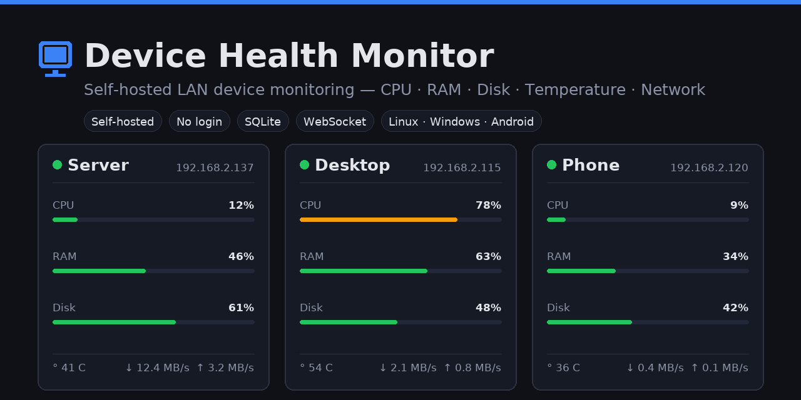

# Device Health Monitor (DHM)


> **English** | [Polski](README.pl.md)

Dashboard + agents for monitoring device health on your network: CPU, RAM, disk, temperature, uptime, network (↓/↑).

- **Server** — Node.js + Express + SQLite (better-sqlite3), also serves the dashboard build (React/Vite).
- **Agent** — Node.js + `systeminformation`, runs on each device; registers itself.
- **Dashboard** — React + Recharts, live updates over WebSocket.
- **Alerts** — disk >90%, CPU >90% for 5 min, temperature >70°C. Offline is a **separate category** (not an alert).
- **Self-monitor** — the server reports itself as a device (`server`), so it shows up on the dashboard without installing an agent.



## Quick start

### 0. One-liner install (from GitHub)

Run the server first, then the agents. The server prints the `REGISTER_TOKEN` at the end —
**paste the one-liner, press Enter, and answer the questions** (port/address, token, report interval).

**Server (Debian/Ubuntu/Fedora):**

```bash
curl -fsSL https://github.com/APOLL0PL/device-health-monitor/releases/latest/download/serwer.sh -o /tmp/serwer.sh && sh /tmp/serwer.sh
```

**Agent — Linux:**

```bash
curl -fsSL https://github.com/APOLL0PL/device-health-monitor/releases/latest/download/user-linux.sh -o /tmp/dhm.sh && sh /tmp/dhm.sh
```

**Agent — Windows (cmd):**

```bat
curl -fsSL https://github.com/APOLL0PL/device-health-monitor/releases/latest/download/user-win.bat -o %TEMP%\user-win.bat && %TEMP%\user-win.bat
```

**Agent — phone (Termux, Android):**

```bash
pkg install -y curl && curl -fsSL https://github.com/APOLL0PL/device-health-monitor/releases/latest/download/setup-termux.sh -o /tmp/setup-dhm.sh && sh /tmp/setup-dhm.sh
```

Each script auto-detects the server (own IP + gateway probe) and otherwise asks; installs Node.js if missing
and configures autostart. All code comes from `releases/latest/download/...` — no build, no `git clone` needed.

**Unattended (no prompts):** set the variables first, e.g.
`REGISTER_TOKEN=<token> SERVER_URL=http://<server-IP>:4000 sh /tmp/dhm.sh`
(Windows: `set REGISTER_TOKEN=<token> && set SERVER_URL=http://<server-IP>:4000 && %TEMP%\user-win.bat`,
server: `PORT=4000 sh /tmp/serwer.sh`).

### 1. Server (Debian/Ubuntu/Fedora)

```bash
./scripts/serwer.sh
```

The script: installs Node (if missing), downloads `dhm-bundle.tar.gz` from GitHub Releases
and extracts it to `~/device-health-monitor`, installs dependencies,
**generates tokens** (`server/.env` + `dashboard/dist/config.js`),
starts the server under pm2 (`dhm-server` :4000), opens ports in UFW and enables autostart (systemd).
Dashboard: `http://<server-IP>:4000` — no login.

Useful variables: `PORT`, `AUTH_TOKEN`, `REGISTER_TOKEN`, `PM2_NAME` (see script header).

### 2. Agent — Linux

```bash
curl -fsSL https://github.com/APOLL0PL/device-health-monitor/releases/latest/download/user-linux.sh -o /tmp/dhm.sh && sh /tmp/dhm.sh
# unattended: REGISTER_TOKEN=<token> SERVER_URL=http://<server-IP>:4000 DEVICE_NAME=Laptop DEVICE_TYPE=laptop
```

The script asks for `REPORT_INTERVAL` (default 60 s), the server address and the registration token;
it downloads the agent from GitHub Releases, installs dependencies, registers the device and
configures autostart (systemd user unit + linger). If `SERVER_URL` is empty it auto-detects
(own IP + gateway probe), otherwise asks.

### 3. Agent — Windows

```bat
curl -fsSL https://github.com/APOLL0PL/device-health-monitor/releases/latest/download/user-win.bat -o %TEMP%\user-win.bat && %TEMP%\user-win.bat
```

Installs Node LTS (winget) and pm2, downloads the agent from GitHub Releases,
installs dependencies, registers and enables autostart (Startup folder). Asks for `REPORT_INTERVAL`,
the server address and the registration token.
Unattended: `set REGISTER_TOKEN=<token> && set SERVER_URL=http://<server-IP>:4000 && %TEMP%\user-win.bat`.
Removal: `uninstall-win.bat`.

### 4. Agent — phone (Termux, Android)

```bash
pkg install -y curl && curl -fsSL https://github.com/APOLL0PL/device-health-monitor/releases/latest/download/setup-termux.sh -o /tmp/setup-dhm.sh && sh /tmp/setup-dhm.sh
```

The script: installs nodejs, downloads the agent from GitHub Releases, registers it, starts it and configures
autostart via Termux:Boot (install "Termux:Boot" from F-Droid and open it once). Asks for
`REPORT_INTERVAL` (default 300 s), the server address and the registration token.
Auto-detection often fails on phones (AP/client isolation) — if it does, type the address when prompted.

## Dashboard features
- Live view (WebSocket + 5 s polling).
- Unit switcher **% ↔ MB/GB** (RAM and disk).
- Disk has **separate panels**: "usage" (% bar) and "used" (GB, with sys breakdown).
- Network: cumulative totals on the card (↓/↑), speed charts **MB/s** (IN/OUT) in details, computed from report deltas.
- Temperature: CPU sensor; on Windows, where the sensor is not exposed, falls back to GPU temperature.

## Screenshots

Main dashboard with devices, alerts and offline panel:


## Security / access model
- **LAN-only** — agents and the dashboard talk to the server only over your local network,
  on the chosen port (default `4000`). No cloud, no internet egress. Do not expose this port
  to the internet unless you know what you are doing.
- **Open reads, no login** — anyone on the LAN can view the dashboard and `GET /api/*` + WebSocket.
- **Writes protected** — deleting devices, renaming, resolving alerts requires `X-Auth-Token` (= `AUTH_TOKEN` from `server/.env`).
- **Agent registration** requires `register_token` (= `REGISTER_TOKEN` from `server/.env`) — blocks fake devices and MAC key theft.
- **Reports** require the `X-Api-Key` issued at registration.
- Tokens are **generated automatically** by `serwer.sh` (`server/.env` + `dashboard/dist/config.js`, both in `.gitignore`). The frontend uses them automatically — no login.
- CORS restricted, rate limiting, input validation, no `?token=` in URLs.

## Requirements

| Component | Requirement |
|-----------|-------------|
| Server    | Linux (Debian/Ubuntu/Fedora/RPi), Node.js ≥ 18, npm |
| Linux agent | Node.js, npm |
| Windows agent | Windows 10/11, Node.js LTS (the script installs it via winget) |
| Phone | Termux + `nodejs-lts` (Android) |

> All installers download the code from **GitHub Releases** — no build, no `git clone`, no `node_modules` in the repo.
> The installers do NOT delete anything; to remove DHM use the uninstall scripts.

## Auto-install scripts

| Platform | Script | What it does |
|----------|--------|--------------|
| Server (Linux) | `scripts/serwer.sh` | downloads the bundle, generates tokens, starts under pm2, UFW, systemd autostart |
| Agent (Linux) | `scripts/user-linux.sh` | downloads the agent, installs dependencies, registers, systemd autostart + linger |
| Agent (Windows) | `scripts/user-win.bat` | winget Node, pm2, registration, autostart (Startup) |
| Agent (Termux) | `scripts/setup-termux.sh` | one-liner: downloads the agent, registers, Termux:Boot autostart |
| Remove (server) | `scripts/uninstall-serwer.sh` | removes pm2 + directory + UFW rules |
| Remove (Linux) | `scripts/uninstall-linux.sh` | removes systemd service + agent directory |
| Remove (Windows) | `scripts/uninstall-win.bat` | removes pm2 + autostart + directory |

The scripts accept variables (`SERVER_URL`, `DEVICE_NAME`, `DEVICE_TYPE`, `REPORT_INTERVAL`,
`REGISTER_TOKEN`, ...) — see the headers of each file.

## Environment variables

| Variable | Where | Description | Default |
|----------|-------|-------------|---------|
| `PORT` | server | HTTP port | `4000` |
| `AUTH_TOKEN` | server | Write token (generated at setup) | auto |
| `REGISTER_TOKEN` | server | Agent registration token (generated) | auto |
| `SELF_REPORT_INTERVAL` | server | Self-monitor interval (ms) | `60000` |
| `SERVER_URL` | agent | DHM server address | `http://localhost:4000` |
| `DEVICE_NAME` | agent | Name on the dashboard | hostname |
| `DEVICE_TYPE` | agent | `server`/`desktop`/`laptop`/`phone`/`android` | `server` |
| `REPORT_INTERVAL` | agent | Reporting interval (s) | `60` (phone: `300`) |
| `REGISTER_TOKEN` | agent | Registration token (only on first install) | — |

Full list: [.env.example](.env.example).

## API

Server: Node.js + Express + SQLite. Reads are **open**; writes require the `X-Auth-Token` header
(= `AUTH_TOKEN` from `server/.env`); the agent reports with the `X-Api-Key` issued at registration.
Errors: `{ "error": "..." }`. Rate limiting: register 5/min/IP, report 30/min/key, writes 30/min/IP.

### Read (no token)
- `GET /api/devices` — device list + `summary: { total, online, offline, activeAlerts }`
- `GET /api/devices/:id` — device + latest metrics
- `GET /api/devices/:id/metrics?hours=24` — metric history (hours 1–720)
- `GET /api/alerts` — active (unresolved) alerts
- `GET /api/summary` — `{ total, online, offline, activeAlerts }`
- WebSocket `ws://<host>:4000` (read-only): `summary` (every 60 s), `device_update`, `metrics`, `alerts`, `device_removed`

Device fields: `name`, `ip`, `type` (`server`/`desktop`/`laptop`/`phone`), `os_name`
(`linux`/`win32`/`android`/...), `mac`, `is_online`, `last_seen`, `last_cpu` (%), `last_ram_used/total/cache`
(MB), `last_disk_used/total` (GB), `last_temp` (°C), `last_net_in/out` (bytes, cumulative counters).

### Write (requires `X-Auth-Token`)
- `PATCH /api/devices/:id` — rename: `{ "name": "..." }`
- `DELETE /api/devices/:id` — removes the device + metrics + alerts
- `POST /api/alerts/:id/resolve` — resolves an alert

### Agent
- `POST /api/agent/register` — body `{ name, ip, type, os_name, mac, register_token }` → `{ id, api_key }` (403 = bad `register_token`)
- `POST /api/agent/report` — metrics + `ip`/`mac`, header `X-Api-Key` → `{ "ok": true }` (403 = bad key, agent re-registers)

### Alerts (serious only — offline is NOT an alert)

| Type | Condition | severity |
|------|-----------|----------|
| `disk_full` | disk usage > 90% | warning, > 97% → critical |
| `high_temp` | temperature > 70°C | warning, > 80°C → critical |
| `high_cpu` | CPU > 90% sustained > 5 min | warning |

### Status codes
`200` OK · `400` validation · `401` missing/bad token · `403` bad agent key / `register_token` ·
`404` device not found · `429` rate limit · `503` token not configured

## Architecture

```
┌─────────────┐   HTTP/WS :4000   ┌─────────────────┐
│  devices    │ ─────────────────▶ │  DHM server     │
│  (agent)    │  register/report   │  server/ + SQLite│──▶ dashboard (React)
└─────────────┘                    └─────────────────┘
```

Agents on computers report every **60 s**, on phones/Android every **5 min**
(set in the installer — see `REPORT_INTERVAL`).

## Troubleshooting

- **Device doesn't show up / crash-loop** — check `pm2 logs dhm-agent`; verify the server responds:
  `curl http://<server-IP>:4000/api/devices`. Fix: `SERVER_URL=http://<server-IP>:4000 pm2 restart dhm-agent --update-env && pm2 save`.
- **Changing port/IP has no effect** — pm2 doesn't swap the env of a running app. Server: rerun
  `PORT=4005 ./serwer.sh` (or `pm2 restart dhm-server --update-env`). Agent: as above with `SERVER_URL`.
- **Dashboard unreachable despite "DONE"** — firewall: `sudo ufw allow <PORT>/tcp`.
- **Server IP changed (DHCP) — everything offline** — on every agent device:
  `SERVER_URL=http://<NEW-IP>:4000 pm2 restart dhm-agent --update-env && pm2 save`. Long-term: DHCP reservation on the router.
- **Dashboard 401 after changing AUTH_TOKEN** — refresh `dashboard/dist/config.js`: rerun `serwer.sh`
  or write `window.DHM_CONFIG = { token: "<AUTH_TOKEN>" };` to that file.
- **Agent logs "API key rejected, re-registering..."** — normal after a DB cleanup; the agent needs `REGISTER_TOKEN`.
- **`npm install` fails on the server** — install `build-essential python3` (needed for `better-sqlite3`).
- **Windows: does user-win.bat touch other apps?** — no. It only `pm2 delete dhm-agent`s the agent itself
  (never `taskkill /f /im node.exe`, never deletes `%USERPROFILE%\.pm2`). `pm2 save` keeps any other pm2 apps.
- **Duplicate device** — remove via `DELETE /api/devices/:id` (loopback registration without a MAC is rejected since 2026-08).
- **Termux: no autostart** — install "Termux:Boot" from F-Droid and open it once.
- **Temperature doesn't work on Windows** — the CPU sensor must be exposed via WMI; falls back to GPU; if absent — "—".

## Repo structure

```
device-health-monitor/
├── server/              ← HTTP + WebSocket + SQLite server
│   ├── index.js         ← API + auth + rate limit + WebSocket
│   ├── db.js
│   ├── lib/store.js     ← devices, metrics, alerts (validation, loopback-fix)
│   ├── lib/selfmonitor.js ← server self-monitoring (skips virtual interfaces)
│   ├── test/            ← node:test suite (API + WebSocket)
│   └── ecosystem.config.cjs
├── agent/               ← device agent (Linux/Windows/Termux)
│   ├── index.js         ← metrics + registration + reporting (skips virtual interfaces)
│   └── ecosystem.config.cjs
├── dashboard/           ← React/Vite dashboard (dist/ committed)
│   └── src/
├── scripts/             ← one-liner installers:
│   ├── serwer.sh        ← server
│   ├── user-linux.sh    ← Linux agent
│   ├── user-win.bat     ← Windows agent
│   ├── setup-termux.sh  ← phone agent (Termux)
│   ├── build-release.sh ← builds the GitHub Release tarballs
│   ├── uninstall-serwer.sh / uninstall-linux.sh / uninstall-win.bat
├── .env.example
├── README.md       ← English
└── README.pl.md    ← Polski
```

## License

MIT — see [LICENSE](LICENSE).
