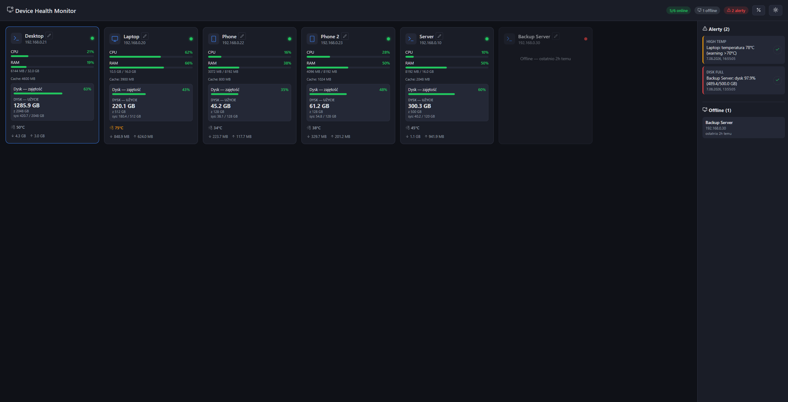
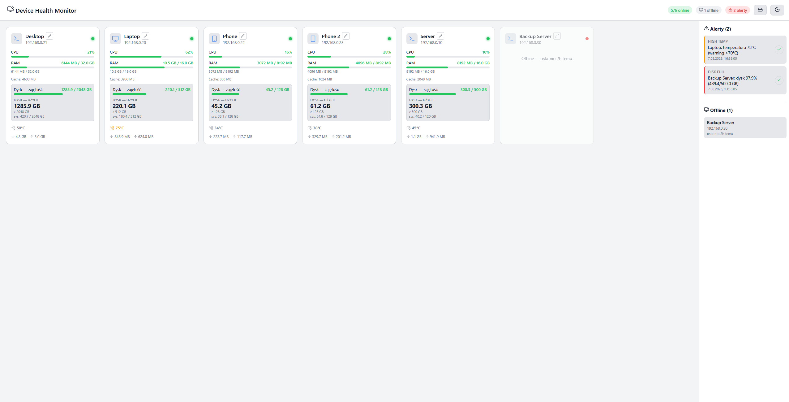

# Device Health Monitor (DHM)


> [English](README.md) | **Polski**

Dashboard + agenty do monitorowania kondycji urządzeń w sieci: CPU, RAM, dysk, temperatura, uptime, sieć (↓/↑).

- **Server** — Node.js + Express + SQLite (better-sqlite3), serwuje też build dashboardu (React/Vite).
- **Agent** — Node.js + `systeminformation`, uruchamiany na każdym urządzeniu; sam się rejestruje.
- **Dashboard** — React + Recharts, aktualizacja na żywo przez WebSocket.
- **Alerty** — dysk >90%, CPU >90% przez 5 min, temperatura >70°C. Offline to **osobna kategoria** (nie alert).
- **Self-monitor** — serwer raportuje sam siebie jako urządzenie (`server`), więc widać go na dashboardzie bez instalowania agenta.

## Funkcje dashboardu
- Widok na żywo (WebSocket + polling 5 s).
- Przełącznik jednostek **% ↔ MB/GB** (RAM i dysk).
- Dysk ma **osobne okienka**: „zajętość" (pasek %) i „użycie" (GB, z podziałem sys).
- Sieć: na karcie sumy skumulowane (↓/↑), w szczegółach wykresy prędkości **MB/s** (IN/OUT) liczone z delt raportów.
- Temperatura: czujnik CPU; na Windows, gdzie czujnik nie jest wystawiony, fallback do temperatury GPU.

## Zrzuty ekranu

Główny dashboard z urządzeniami, alertami i panelem offline:



Szczegóły urządzenia z wykresami (CPU, RAM, dysk, temperatura, sieć):



## Bezpieczeństwo / model dostępu
- **Tylko LAN** — agenty i dashboard komunikują się z serwerem wyłącznie w sieci lokalnej,
  na wybranym porcie (domyślnie `4000`). Bez chmury, bez wychodzenia do internetu.
  Nie wystawiaj tego portu na internet bez znajomości konsekwencji.
- **Odczyt otwarty, bez logowania** — każdy w sieci LAN widzi dashboard i `GET /api/*` + WebSocket.
- **Zapis chroniony** — usuwanie urządzeń, zmiana nazw, rozwiązywanie alertów wymaga `X-Auth-Token` (= `AUTH_TOKEN` z `server/.env`).
- **Rejestracja agentów** wymaga `register_token` (= `REGISTER_TOKEN` z `server/.env`) — blokuje fałszywe urządzenia i kradzież kluczy po MAC.
- **Raporty** wymagają `X-Api-Key` wydanego przy rejestracji.
- Tokeny **generują się automatycznie** w `serwer.sh` (`server/.env` + `dashboard/dist/config.js`, oba w `.gitignore`). Frontend używa ich sam — zero logowania.
- CORS ograniczony, rate limiting, walidacja wejścia, brak `?token=` w URL.

## Architektura

```
┌─────────────┐   HTTP/WS :4000   ┌─────────────────┐
│  urządzenia │ ─────────────────▶ │  serwer DHM      │
│  (agent)    │  register/report   │  server/ + SQLite│──▶ dashboard (React)
└─────────────┘                    └─────────────────┘
```

Agent na komputerach raportuje co **60 s**, na telefonach/Androida co **5 min**
(ustawisz to w instalatorze, patrz `REPORT_INTERVAL`).

## Wymagania

| Składnik | Wymaganie |
|----------|-----------|
| Serwer    | Linux (Debian/Ubuntu/Fedora/RPi), Node.js ≥ 18, npm |
| Agent Linux | Node.js, npm |
| Agent Windows | Windows 10/11, Node.js LTS (skrypt doinstaluje przez winget) |
| Telefon | Termux + `nodejs-lts` (Android) |

> Wszystkie instalatory pobierają kod z **GitHub Releases** — bez buildowania, bez `git clone`,
> bez `node_modules` w repo. Instalatory NIE kasują niczego; do usunięcia DHM służą skrypty uninstall.

## Szybki start

### 0. Instalacja 1-linerem (z GitHub)

Najpierw serwer, potem agenty. Serwer na końcu wypisuje `REGISTER_TOKEN`.

**Serwer (Debian/Ubuntu/Fedora):**

```bash
curl -fsSL https://github.com/APOLL0PL/device-health-monitor/releases/latest/download/serwer.sh -o /tmp/serwer.sh && sh /tmp/serwer.sh
```

**Agent — Linux:**

```bash
curl -fsSL https://github.com/APOLL0PL/device-health-monitor/releases/latest/download/user-linux.sh -o /tmp/dhm.sh && REGISTER_TOKEN=<token> sh /tmp/dhm.sh
# własny serwer (np. gdy auto-detekcja nie działa): SERVER_URL=http://<IP-serwera>:4000
```

**Agent — Windows (cmd):**

```bat
curl -fsSL https://github.com/APOLL0PL/device-health-monitor/releases/latest/download/user-win.bat -o %TEMP%\user-win.bat && %TEMP%\user-win.bat
```

**Agent — telefon (Termux, Android):**

```bash
pkg install -y curl && curl -fsSL https://github.com/APOLL0PL/device-health-monitor/releases/latest/download/setup-termux.sh -o /tmp/setup-dhm.sh && REGISTER_TOKEN=<token> sh /tmp/setup-dhm.sh
```

Każdy skrypt sam wykrywa serwer (probe w sieci lokalnej), instaluje Node.js jeśli brak
i konfiguruje autostart. Cały kod pochodzi z `releases/latest/download/...` — bez buildowania
i bez `git clone`.

### 1. Serwer (Debian/Ubuntu/Fedora)

```bash
./scripts/serwer.sh
```

Skrypt: instaluje Node (jeśli brak), pobiera `dhm-bundle.tar.gz` z GitHub Releases
i rozpakowuje do `~/device-health-monitor`, instaluje zależności,
**generuje tokeny** (`server/.env` + `dashboard/dist/config.js`),
startuje serwer pod pm2 (`dhm-server` :4000), otwiera porty w UFW i włącza autostart (systemd).
Dashboard: `http://<IP-serwera>:4000` — bez logowania.

Użyteczne zmienne: `PORT`, `AUTH_TOKEN`, `REGISTER_TOKEN`, `PM2_NAME` (patrz nagłówek skryptu).

### 2. Agent — Linux

```bash
./scripts/user-linux.sh
# własny adres serwera i nazwa urządzenia:
SERVER_URL=http://192.168.0.10:4000 DEVICE_NAME=Laptop DEVICE_TYPE=laptop ./scripts/user-linux.sh
```

Skrypt pyta o `REPORT_INTERVAL` (default 60 s), pobiera agenta z GitHub Releases,
instaluje zależności, rejestruje urządzenie i konfiguruje autostart (systemd user unit + linger).
Token rejestracji: `REGISTER_TOKEN=<token>`.

### 3. Agent — Windows

```bat
user-win.bat
```

Instaluje Node LTS (winget) i pm2, pobiera agenta z GitHub Releases,
instaluje zależności, rejestruje i włącza autostart (folder Startup). Pyta o `REPORT_INTERVAL`.
Token rejestracji: `set REGISTER_TOKEN=<token>` przed uruchomieniem.
Usunięcie: `uninstall-win.bat`.

### 4. Agent — telefon (Termux, Android)

```bash
pkg install -y curl && curl -fsSL https://github.com/APOLL0PL/device-health-monitor/releases/latest/download/setup-termux.sh -o /tmp/setup-dhm.sh && REGISTER_TOKEN=<token> sh /tmp/setup-dhm.sh
```

Skrypt: instaluje nodejs, pobiera agenta z GitHub Releases, rejestruje, startuje i konfiguruje autostart przez
Termux:Boot (zainstaluj „Termux:Boot" z F-Droid i otwórz raz). Pyta o `REPORT_INTERVAL` (default 300 s).

## Skrypty auto-instalacji

| Platforma | Skrypt | Co robi |
|-----------|--------|---------|
| Serwer (Linux) | `scripts/serwer.sh` | pobiera bundle, generuje tokeny, startuje pod pm2, UFW, autostart systemd |
| Agent (Linux) | `scripts/user-linux.sh` | pobiera agenta, instaluje zależności, rejestruje, autostart systemd + linger |
| Agent (Windows) | `scripts/user-win.bat` | winget Node, pm2, rejestracja, autostart (Startup) |
| Agent (Termux) | `scripts/setup-termux.sh` | one-liner: pobiera agenta, rejestruje, autostart Termux:Boot |
| Usuwanie (serwer) | `scripts/uninstall-serwer.sh` | usuwa pm2 + katalog + reguły UFW |
| Usuwanie (Linux) | `scripts/uninstall-linux.sh` | usuwa usługę systemd + katalog agenta |
| Usuwanie (Windows) | `scripts/uninstall-win.bat` | usuwa pm2 + autostart + katalog |

Skrypty przyjmują zmienne (`SERVER_URL`, `DEVICE_NAME`, `DEVICE_TYPE`, `REPORT_INTERVAL`,
`REGISTER_TOKEN`, ...) — patrz nagłówki plików.

## Zmienne środowiskowe

| Zmienna | Gdzie | Opis | Domyślna |
|---------|-------|------|----------|
| `PORT` | server | Port HTTP | `4000` |
| `AUTH_TOKEN` | server | Token zapisów (generowany przy setupie) | auto |
| `REGISTER_TOKEN` | server | Token rejestracji agentów (generowany) | auto |
| `SELF_REPORT_INTERVAL` | server | Interwał self-monitora (ms) | `60000` |
| `SERVER_URL` | agent | Adres serwera DHM | `http://localhost:4000` |
| `DEVICE_NAME` | agent | Nazwa na dashboardzie | hostname |
| `DEVICE_TYPE` | agent | `server`/`desktop`/`laptop`/`phone`/`android` | `server` |
| `REPORT_INTERVAL` | agent | Interwał raportowania (s) | `60` (phone: `300`) |
| `REGISTER_TOKEN` | agent | Token rejestracji (tylko przy pierwszej instalacji) | — |

Pełna lista: [.env.example](.env.example).

## API

Serwer: Node.js + Express + SQLite. Odczyt jest **otwarty**; zapis wymaga nagłówka `X-Auth-Token`
(= `AUTH_TOKEN` z `server/.env`); agent raportuje z kluczem `X-Api-Key` wydanym przy rejestracji.
Błędy: `{ "error": "..." }`. Rate limiting: register 5/min/IP, report 30/min/klucz, zapisy 30/min/IP.

### Odczyt (bez tokenu)
- `GET /api/devices` — lista urządzeń + `summary: { total, online, offline, activeAlerts }`
- `GET /api/devices/:id` — urządzenie + ostatnie metryki
- `GET /api/devices/:id/metrics?hours=24` — historia metryk (hours 1–720)
- `GET /api/alerts` — aktywne (nierozwiązane) alerty
- `GET /api/summary` — `{ total, online, offline, activeAlerts }`
- WebSocket `ws://<host>:4000` (read-only): `summary` (co 60 s), `device_update`, `metrics`, `alerts`, `device_removed`

Pole urządzenia: `name`, `ip`, `type` (`server`/`desktop`/`laptop`/`phone`), `os_name`
(`linux`/`win32`/`android`/...), `mac`, `is_online`, `last_seen`, `last_cpu` (%), `last_ram_used/total/cache`
(MB), `last_disk_used/total` (GB), `last_temp` (°C), `last_net_in/out` (bajty, liczniki skumulowane).

### Zapis (wymaga `X-Auth-Token`)
- `PATCH /api/devices/:id` — zmiana nazwy: `{ "name": "..." }`
- `DELETE /api/devices/:id` — usuwa urządzenie + metryki + alerty
- `POST /api/alerts/:id/resolve` — rozwiązuje alert

### Agent
- `POST /api/agent/register` — body `{ name, ip, type, os_name, mac, register_token }` → `{ id, api_key }` (403 = zły `register_token`)
- `POST /api/agent/report` — metryki + `ip`/`mac`, nagłówek `X-Api-Key` → `{ "ok": true }` (403 = zły klucz, agent rejestruje się ponownie)

### Alerty (tylko poważne — offline NIE jest alertem)

| Typ | Warunek | severity |
|-----|---------|----------|
| `disk_full` | dysk użyty > 90% | warning, > 97% → critical |
| `high_temp` | temperatura > 70°C | warning, > 80°C → critical |
| `high_cpu` | CPU > 90% utrzymujące się > 5 min | warning |

### Kody statusu
`200` OK · `400` walidacja · `401` brak/zły token · `403` zły klucz agenta / `register_token` ·
`404` brak urządzenia · `429` rate limit · `503` token nie skonfigurowany

## Rozwiązywanie problemów

- **Urządzenie się nie pojawia / crash-loop** — `pm2 logs dhm-agent`; sprawdź, czy serwer odpowiada:
  `curl http://IP-SERWERA:4000/api/devices`. Naprawa: `SERVER_URL=http://IP-SERWERA:4000 pm2 restart dhm-agent --update-env && pm2 save`.
- **Zmiana portu/IP nie działa** — pm2 nie podmienia środowiska działającej aplikacji. Serwer: odpal
  `PORT=4005 ./serwer.sh` od nowa (albo `pm2 restart dhm-server --update-env`). Agent: jak wyżej z `SERVER_URL`.
- **Dashboard nie wchodzi mimo „GOTOWE"** — firewall: `sudo ufw allow <PORT>/tcp`.
- **Zmieniło się IP serwera (DHCP) — wszystko offline** — na każdym urządzeniu:
  `SERVER_URL=http://NOWE-IP:4000 pm2 restart dhm-agent --update-env && pm2 save`. Na przyszłość: rezerwacja DHCP na routerze.
- **Dashboard 401 po zmianie AUTH_TOKEN** — odśwież `dashboard/dist/config.js`: odpal ponownie `serwer.sh`
  albo zapisz `window.DHM_CONFIG = { token: "<AUTH_TOKEN>" };` do tego pliku.
- **Agent: „API key rejected, re-registering..."** — normalne po czyszczeniu bazy; agent potrzebuje `REGISTER_TOKEN`.
- **`npm install` fail na serwerze** — doinstaluj `build-essential python3` (potrzebne dla `better-sqlite3`).
- **Windows: user-win.bat czyści inne aplikacje** — skrypt robi `taskkill /f /im node.exe` i kasuje
  `%USERPROFILE%\.pm2`. Na maszynie z innymi aplikacjami pm2: najpierw `pm2 save` i kopia `dump.pm2`.
- **Duplikat urządzenia** — usuń przez `DELETE /api/devices/:id` (rejestracja z loopback bez MAC od 2026-08 jest odrzucana).
- **Termux: brak autostartu** — zainstaluj „Termux:Boot" z F-Droid i otwórz go raz.
- **Temperatura na Windows nie działa** — czujnik CPU musi być wystawiony w WMI; fallback do GPU; jeśli brak — „—".

## Struktura repo

```
device-health-monitor/
├── server/              ← serwer HTTP + WebSocket + SQLite
│   ├── index.js         ← API + autoryzacja + rate limit + WebSocket
│   ├── db.js
│   ├── lib/store.js     ← urządzenia, metryki, alerty (walidacja, loopback-fix)
│   ├── lib/selfmonitor.js ← self-monitoring serwera (pomija interfejsy wirtualne)
│   ├── lib/ratelimit.js ← proste rate limiting (zero zależności)
│   └── ecosystem.config.js
├── agent/               ← agent urządzenia (Linux/Windows/Termux)
│   ├── index.js         ← metryki + rejestracja + raportowanie (interfejsy wirtualne pomijane)
│   └── ecosystem.config.js
├── dashboard/           ← React/Vite dashboard (dist/ commitowany)
│   └── src/
├── scripts/             ← instalatory 1-linerami:
│   ├── serwer.sh        ← serwer
│   ├── user-linux.sh    ← agent Linux
│   ├── user-win.bat     ← agent Windows
│   ├── setup-termux.sh  ← agent telefon (Termux)
│   ├── build-release.sh ← buduje tarballe na GitHub Release
│   ├── uninstall-serwer.sh / uninstall-linux.sh / uninstall-win.bat
├── .env.example
├── README.md       ← English
└── README.pl.md    ← Polski
```

## Licencja

MIT — patrz [LICENSE](LICENSE).
